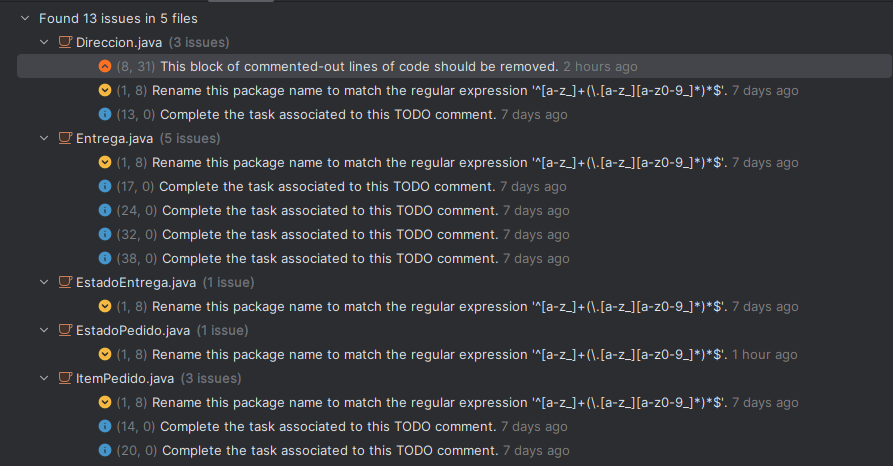

# Módulo: Pedidos

Este módulo forma parte del proyecto `software-project`.
---

# Laboratorio 9

---
## Objetivos del Trabajo

- Aplicar convenciones de codificación del lenguaje Java (nombres, estructura, comentarios).
- Mejorar la mantenibilidad mediante la detección y corrección de **Code Smells** y otras alertas mediante SonarLint.
- Documentar las prácticas aplicadas y los cambios realizados en el código fuente.

---

## Análisis SonarLint

El analisis estatico de los archivos del modulo `Pedidos` detectó un total de **13 Code Smells** distribuidos en 5 archivos. A continuacion, se detallan los principales problemas detectados y su respectiva solucion.

---

## Prácticas de Mejora Aplicadas

### 1. Eliminación de Código Comentado

> **Problema**: Se encontraron lineas de código comentado no utilizado, lo cual es considerado ruido visual y genera mantenimiento innecesario.  
> **Archivo**: `Direccion.java`

**Antes:**
// public Pedido 1;

> **Solucion**: Se elimino el codigo comentado innecesario para mantener limpio el codigo.

### 2. Implementacion de TODOs
> **Problema**: Existían comentarios // TODO sin implementación en múltiples archivos (Direccion.java, Entrega.java, ItemPedido.java).  

**Antes:**
// TODO implement here

> **Solucion**: Todos los métodos pendientes fueron implementados, y los comentarios TODO eliminados para reflejar que ya no hay tareas sin desarrollar.

### 3. Integración de Campo Previamente No Utilizado
> **Problema**: El atributo coordenadas fue reportado por SonarLint como no utilizado.  

**Archivo**: `Direccion.java`

> **Solucion**: En lugar de eliminar el atributo, se integró funcionalmente a la clase, de la siguiente forma:

**Cambios Realizados:**

- Se añadieron sus métodos `getter` y `setter`:

public String getCoordenadas() {
    return coordenadas;
}

public void setCoordenadas(String coordenadas) {
    this.coordenadas = coordenadas;
}
- Se incluyo en la validacion de direccion.

public boolean esValida() {
    return calle != null && !calle.isEmpty()
        && numero > 0
        && ciudad != null
        && distrito != null
        && coordenadas != null;
}

### 4. Correcion de Paquetes

> **Problema**: Se encontraron lineas de código comentado no utilizado, lo cual es considerado ruido visual y genera mantenimiento innecesario.  

**Antes:**
package org.unsa.softwareproject.Dominio.Pedidos;

> **Solucion**: Todos los paquetes fueron corregidos para cumplir con el formato, como lo requiere sonarlist.

## Nomenclatura y buenas practicas de java

- Clases nombradas en PascalCase(Pedido, Direccion, ItemPedido).
- Variables y metodos en camelCase.
- Uso de verbos en nombres de metodos (esValida(), añadirItem())
- Separacion de responsabilidades en las clases de dominio

## Referencias
- https://www.oracle.com/java/technologies/javase/codeconventions-contents.html

# Laboratorio 10

---

# Estilos aplicados:


> **Cookbook**: Se aplicó el estilo Cookbook al dividir responsabilidades en métodos pequeños y reutilizables. Ejemplo en `ItemPedido.java`:

```java
private void validarCantidad() {
    if (cantidad <= 0) {
        throw new IllegalArgumentException("La cantidad debe ser mayor a 0");
    }
}
```
---

> **Guard Clauses + Error Handling**: Se aplicó Guard Clauses junto con manejo de errores para simplificar el control de flujo y validar condiciones antes de continuar. Ejemplos en Pedido.java y Entrega.java
```java
public void cancelar() {
    if (this.estado == EstadoPedido.ENTREGADO){
        throw new IllegalStateException("No se puede cancelar un pedido entregado.");
    }
    this.estado = EstadoPedido.CANCELADO;
}
```
```java
if (nuevoEstado == null) {
    throw new IllegalArgumentException("El nuevo estado no puede ser nulo.");
}
```
---

> **Pipeline**: Se usó estilo Pipeline en el método calcularMontoTotal() de Pedido, con flujo de operaciones encadenadas.
```java
public Dinero calcularMontoTotal() {
    this.montoTotal = items.stream()
        .map(ItemPedido::calcularSubtotal)
        .reduce(new Dinero(0.0, "PEN"), Dinero::sumar);
    return this.montoTotal;
}
```
---
> **Things**: El proyecto aplica principios del estilo Thing-First Design al definir entidades del dominio (Pedido, Entrega, ItemPedido, EstadoEntrega, etc.) como clases diferenciadas. Este enfoque estructura el diseño en base a objetos que representan cosas del mundo real.

# Errores detectados por SonarLint

> **1.- En Entrega.java**: Merge this if statement with the enclosing one.
> **Solucion**
```java
public void actualizarEstado(EstadoEntrega nuevoEstado) {
    if (this.estado == EstadoEntrega.ENTREGADO && nuevoEstado != EstadoEntrega.INCIDENCIA) {
        throw new IllegalStateException("No se puede cambiar el estado de una entrega ya completada");
    }
    if (nuevoEstado == null) {
        throw new IllegalArgumentException("El nuevo estado no puede ser nulo.");
    }
    this.estado = nuevoEstado;
}
```
> **2.- En Pedido.java**: Rename this method name to match the regular expression "^[a-z][a-zA-Z0-9]*$".
> **Solucion**
```java
public void addItem(ItemPedido item) {
    if (item == null) {
        throw new IllegalArgumentException("El item no puede ser nulo");
    }
    this.items.add(item);
    this.montoTotal = this.calcularMontoTotal();
}
```

# Laboratorio 11 Clean Code
---
# Buenas Practicas Aplicadas
---
> **1.- Nombres**: Se cambiaron nombres como calcularMonto → calcularMontoTotal, actualizar → actualizarEstado para reflejar con precisión la acción realizada.
Variables como monto -> montoTotal, listaItems -> items,  para una mejor comprensión.
---
> **2.- Funciones**:Se dividieron responsabilidades dentro de funciones. Por ejemplo:
addItem() ahora valida la entrada y actualiza el monto.
asignarRepartidor() verifica condiciones antes de cambiar estado.
---
> **3.- Comentarios**: Se añadieron comentarios Javadoc a métodos públicos en ItemPedido
```java
    /**
     * Actualiza la cantidad del ítem y recalcula el subtotal.
     * @param nuevaCantidad cantidad nueva a asignar
     */
    public void actualizarCantidad(int nuevaCantidad) {
        setCantidad(nuevaCantidad);
        calcularSubtotal();
    }
```
---
> **4.- Estructura del Codigo Fuente**: Se maneja un orden logico atributos->constructor->metodos publicos->getters/setters->metodos  privados.
---
> **5.- Objetos y Estructuras de Datos**: Se respeto el principio de encapsulamiento
La lista de ítems se retorna como copia (new ArrayList<>(items)) para evitar modificaciones externas.
La clase Dinero encapsula correctamente operaciones monetarias, protegiendo la integridad del valor total del pedido.
---
> **6.- Tratamiento de Errores**:Se usaron excepciones específicas (IllegalArgumentException, IllegalStateException) en validaciones
```java
if (estado == null) {
    throw new IllegalArgumentException("El estado no puede ser nulo");
}

```
---
> **7.- Clases**:
Clases como Direccion, ItemPedido, Entrega y Pedido ahora tienen:

Métodos con responsabilidad única.
Encapsulamiento claro y coherente.
Uso de clases auxiliares (Dinero, Direccion) para separar responsabilidades y facilitar pruebas.

# SonarLint
Tras realizar las buenas practicas descritas, no se encontraron bugs, code smells ni vulnerabilidades

---
# Laboratorio 12 Principios SOLID

# Buenas Practicas Aplicadas
---
> **1.- Principio de Responsabilidad Unica (SRP)**:Cada clase debe tener una única razón para cambiar, es decir, encargarse de una única responsabilidad.
Ejemplo 1: ItemPedido.java: Encargado solo de representar un ítem del pedido y calcular su subtotal. No gestiona pedidos ni entregas completas.
```java
public Dinero calcularSubtotal() {
    validarCantidad();
    this.subtotal = precioUnitario.multiplicar(cantidad);
    return this.subtotal;
}
```
Ejemplo 2: Entrega.java: Se responsabiliza únicamente del estado de una entrega, su repartidor y su dirección.
```java
public void actualizarEstado(EstadoEntrega nuevoEstado) {
    if (this.estado == EstadoEntrega.ENTREGADO && nuevoEstado != EstadoEntrega.INCIDENCIA) {
        throw new IllegalStateException("No se puede cambiar el estado de una entrega ya completada");
    }
    this.estado = nuevoEstado;
}
```
---
> **2.- Principio Abierto/Cerrado (OCP)**: Las clases deben estar abiertas para extensión, pero cerradas para modificación.
Ejemplo 1: Dinero y ItemPedido
La clase Dinero encapsula la lógica monetaria. ItemPedido puede trabajar con distintos comportamientos de Dinero sin modificar su lógica.
```java
this.subtotal = precioUnitario.multiplicar(cantidad); // extensión sin modificar ItemPedido
```
Ejemplo 2: Manejo del estado en Entrega
Permite modificar estados válidos sin cambiar la clase gracias a condiciones bien definidas:
```java

if (this.estado == EstadoEntrega.ENTREGADO && nuevoEstado != EstadoEntrega.INCIDENCIA) {
    throw new IllegalStateException("No se puede cambiar el estado...");
}
``` 
---
> **3.- Principio de Inversión de Dependencias (DIP)**: Los módulos de alto nivel no deben depender de módulos de bajo nivel, ambos deben depender de abstracciones.
Ejemplo 1: Uso de clase Dinero como dependencia
ItemPedido y Pedido dependen de la abstracción Dinero, no de primitivas como double o float.
```java
private Dinero precioUnitario;
private Dinero subtotal;
```
Ejemplo 2: Entrega depende de Direccion
Entrega no depende de primitivas para representar una dirección (como String calle, String 
ciudad...), sino de una clase Direccion específica.
```java
private Direccion direccionEntrega;
```

# SonarLint
No se encontraron bugs, code smells ni vulnerabilidades