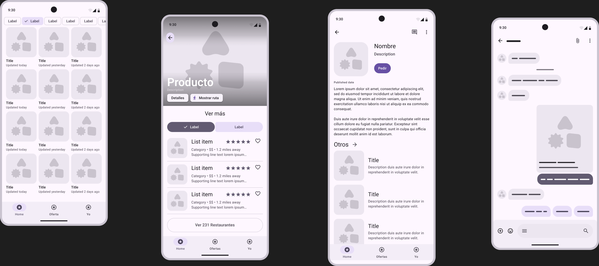
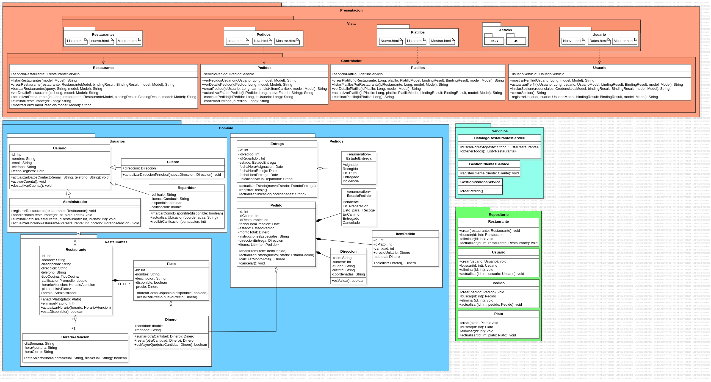

# SueldoMinimo App

## Índice
1. [Equipo de Trabajo e Integrantes](#equipo-de-trabajo-e-integrantes)
2. [Propósito del Proyecto](#propósito-del-proyecto)
3. [Funcionalidades](#funcionalidades)
   - [Alto Nivel (Diagrama de Casos de Uso UML)](#alto-nivel-diagrama-de-casos-de-uso-uml)
   - [Prototipo (GUI)](#prototipo-gui)
4. [Modelo de Dominio](#modelo-de-dominio)
   - [Diagrama de Clases](#diagrama-de-clases)
   - [Módulos](#módulos)
5. [Visión General de Arquitectura](#visión-general-de-arquitectura)
   - [DDD y Arquitectura Limpia](#ddd-y-arquitectura-limpia)
   - [Diagrama de Paquetes](#diagrama-de-paquetes)
   - [Clases Principales](#clases-principales)
6. [Prácticas de Desarrollo Aplicadas](#prácticas-de-desarrollo-aplicadas)
   - [Estilos de Programación](#estilos-de-programación)
   - [Convenciones de Codificación](#convenciones-de-codificación)
   - [Codificación Limpia (Clean Code)](#codificación-limpia-clean-code)
   - [Principios SOLID](#principios-solid)
   - [Domain-driven Design (DDD)](#domain-driven-design-ddd)
     - [Entidades y Objetos de Valor](#entidades-y-objetos-de-valor)
     - [Agregados y Módulos](#agregados-y-módulos)
     - [Fábricas](#fábricas)
     - [Repositorios](#repositorios)
     - [Arquitectura en Capas](#arquitectura-en-capas)
7. [Gestión de Proyecto](#gestión-de-proyecto)

## Equipo de Trabajo e Integrantes
- Torres Ara Alberto Gabriel
- Meza Pareja Arthur Patrick
- Diaz Vasquez Esdras Amado
- Rivera Cruz Diego Benjamin

## Propósito del Proyecto
Desarrollar una aplicación web  que conecte a consumidores con negocios locales de comida de Arequipa, con el fin de mejorar el acceso a opciones alimenticias económicas, saludables y promover el empleo independiente mediante repartidores.

## Funcionalidades

### Alto Nivel (Diagrama de Casos de Uso UML)

La aplicación SueldoMinimo ofrece las siguientes funcionalidades principales:

1. **Gestión de Usuarios**
   - Registro y autenticación de usuarios
   - Actualización de datos personales
   - Activación/desactivación de cuentas

2. **Gestión de Restaurantes**
   - Registro y actualización de información de restaurantes
   - Gestión de menús y platos
   - Control de horarios de atención

3. **Gestión de Pedidos**
   - Creación de pedidos
   - Seguimiento del estado de los pedidos
   - Asignación de repartidores
   - Cancelación de pedidos

### Prototipo (GUI)

A continuación se muestra el prototipo de la interfaz de usuario de la aplicación:



## Modelo de Dominio

### Diagrama de Clases

El siguiente diagrama muestra las principales entidades del sistema y sus relaciones:



### Módulos

El sistema está organizado en los siguientes módulos principales:

1. **Módulo de Usuarios**
   - Gestión de clientes, repartidores y administradores
   - Autenticación y autorización
   - Perfiles de usuario

2. **Módulo de Restaurantes**
   - Catálogo de restaurantes
   - Gestión de menús y platos
   - Horarios de atención

3. **Módulo de Pedidos**
   - Creación y seguimiento de pedidos
   - Asignación de repartidores
   - Estados del pedido

## Visión General de Arquitectura

### DDD y Arquitectura Limpia

El proyecto implementa los principios de Domain-Driven Design (DDD) y Arquitectura Limpia para garantizar una separación clara de responsabilidades y un diseño centrado en el dominio del negocio. La arquitectura se organiza en las siguientes capas:

1. **Capa de Dominio**: Contiene las entidades, objetos de valor, agregados y reglas de negocio.
2. **Capa de Aplicación**: Implementa los casos de uso y coordina las operaciones del dominio.
3. **Capa de Infraestructura**: Proporciona implementaciones concretas para persistencia.
4. **Capa de Interfaz de Usuario**: Maneja la interacción con el usuario a través de controladores REST.

### Diagrama de Paquetes

La estructura de paquetes del proyecto refleja la arquitectura en capas y la organización por módulos:

```
src/
├── main/
│   ├── java/
│   │   └── org/
│   │       └── unsa/
│   │           └── model/
│   │               ├── controller/    # Controladores REST
│   │               ├── domain/        # Entidades y modelos
│   │               │   ├── pedidos/
│   │               │   ├── restaurantes/
│   │               │   └── usuarios/
│   │               ├── dtos/          # Objetos de transferencia de datos
│   │               ├── repository/    # Interfaces de repositorio
│   │               └── service/       # Servicios e implementaciones
│   │                   ├── Interfaces/
│   │                   └── impl/
│   └── resources/                    # Configuraciones y recursos
└── test/                             # Pruebas unitarias e integración
```

### Clases Principales

#### Entidades Principales

**Usuarios**
- **Usuario**: Clase base para todos los usuarios del sistema.
- **Cliente**: Usuario que realiza pedidos.
- **Repartidor**: Usuario que entrega pedidos.
- **Administrador**: Usuario con privilegios de gestión del sistema.

**Restaurantes**
- **Restaurante**: Representa un negocio de comida con platos y horarios.
- **Plato**: Productos ofrecidos por los restaurantes.
- **HorarioAtencion**: Define los horarios de operación de un restaurante.
- **TipoCocina**: Categorización de los restaurantes por tipo de comida.

**Pedidos**
- **Pedido**: Representa una orden realizada por un cliente.
- **ItemPedido**: Elemento individual dentro de un pedido.
- **EstadoPedido**: Estados posibles de un pedido (PENDIENTE, EN_PREPARACION, etc.).
- **Entrega**: Información sobre la entrega de un pedido.

## Prácticas de Desarrollo Aplicadas

### Estilos de Programación

#### 1. Things (Orientación a Objetos)
Este estilo está presente en las entidades de dominio como Usuario, Restaurante y especialmente Pedido, que representa un pedido real del mundo físico. Cada clase refleja una cosa del negocio con sus atributos, relaciones (como Cliente, ItemPedido, Direccion) y métodos que encapsulan su comportamiento (actualizarEstado, calcularMontoTotal).

**Ejemplo del proyecto:**
```java
@Entity
@Table(name = "usuarios")
@Inheritance(strategy = InheritanceType.JOINED)
public class Usuario {
    @Id
    @GeneratedValue(strategy = GenerationType.IDENTITY)
    private Integer id;
    private String nombre;
    @Column(unique = true, nullable = false)
    private String email;
    private String telefono;
    private boolean activo;
    
    @Embedded
    private Direccion direccionPrincipal;
    
    // Comportamiento encapsulado
    public void activarCuenta() {
        this.activo = true;
        logger.info(() -> "Cuenta de usuario " + this.nombre + " (ID: " + this.id + ") activada.");
    }
    
    public void desactivarCuenta() {
        this.activo = false;
        logger.info(() -> "Cuenta de usuario " + this.nombre + " (ID: " + this.id + ") desactivada.");
    }
    
    public void actualizarDatosContacto(String email, String telefono) {
        try {
            setEmail(email);
            this.telefono = telefono;
            logger.info(() -> "Datos de contacto actualizados para usuario " + this.nombre);
        } catch (IllegalArgumentException e) {
            logger.log(Level.SEVERE, "Fallo al actualizar datos de contacto: " + e.getMessage(), e);
        }
    }
}
```

#### 2. RESTful
Seguimos los principios REST para el diseño de nuestra API, con endpoints que representan recursos y operaciones HTTP semánticamente correctas.

**Ejemplo del proyecto:**
```java
@RestController
@RequestMapping("/usuarios")
public class UsuariosController {
    
    @PostMapping
    public ResponseEntity<Usuario> crearUsuario(@Valid @RequestBody CrearUsuarioRequest request) {
        logger.info("Recibida solicitud para crear un nuevo usuario con email: {}", request.getEmail());
        try {
            Usuario nuevoUsuario = usuarioServicio.crearUsuario(request);
            return new ResponseEntity<>(nuevoUsuario, HttpStatus.CREATED);
        } catch (IllegalArgumentException e) {
            logger.warn("Error de validación: {}", e.getMessage());
            return new ResponseEntity<>(HttpStatus.BAD_REQUEST);
        } catch (DataIntegrityViolationException e) {
            logger.warn("Error de integridad de datos: {}", e.getMessage());
            return new ResponseEntity<>(HttpStatus.CONFLICT);
        }
    }
    
    @GetMapping("/{id}")
    public ResponseEntity<Usuario> obtenerUsuarioPorId(@PathVariable Integer id) {
        logger.info("Recibida solicitud para obtener usuario con ID: {}", id);
        Usuario usuario = usuarioServicio.obtenerUsuarioPorId(id);
        if (usuario != null) {
            return new ResponseEntity<>(usuario, HttpStatus.OK);
        } else {
            logger.warn("Usuario con ID {} no encontrado.", id);
            return new ResponseEntity<>(HttpStatus.NOT_FOUND);
        }
    }
    
    @DeleteMapping("/{id}")
    public ResponseEntity<Void> eliminarUsuario(@PathVariable Integer id) {
        logger.info("Recibida solicitud para eliminar usuario con ID: {}", id);
        try {
            usuarioServicio.eliminarUsuario(id);
            return new ResponseEntity<>(HttpStatus.NO_CONTENT);
        } catch (IllegalArgumentException e) {
            logger.warn("Usuario con ID {} no encontrado para eliminar", id);
            return new ResponseEntity<>(HttpStatus.NOT_FOUND);
        }
    }
}
```

#### 3. Manejo de Errores/Excepciones
Implementamos un manejo robusto de errores con logging detallado y respuestas HTTP apropiadas.

**Ejemplo del proyecto:**
```java
@Service
public class GestionUsuarioService implements IUsuarioServicio {
    
    @Override
    @Transactional
    public Usuario crearUsuario(CrearUsuarioRequest request) {
        logger.info("Intentando crear un nuevo usuario con email: {}", request.getEmail());
        
        if (usuarioRepository.findByEmail(request.getEmail()).isPresent()) {
            logger.warn("Fallo al crear usuario: el email '{}' ya está registrado.", request.getEmail());
            throw new IllegalArgumentException("El email '" + request.getEmail() + "' ya está registrado.");
        }
        
        try {
            Cliente nuevoCliente = new Cliente();
            nuevoCliente.setNombre(request.getNombre());
            nuevoCliente.setEmail(request.getEmail());
            nuevoCliente.setTelefono(request.getTelefono());
            
            Usuario nuevoUsuario = clienteRepository.save(nuevoCliente);
            logger.info("Usuario con ID {} y email {} creado exitosamente.", 
                       nuevoUsuario.getId(), nuevoUsuario.getEmail());
            return nuevoUsuario;
        } catch (DataIntegrityViolationException e) {
            logger.error("Error de integridad de datos: {}", e.getMessage(), e);
            throw new DataIntegrityViolationException("Error al guardar usuario debido a un problema de integridad de datos.", e);
        } catch (Exception e) {
            logger.error("Error inesperado al crear usuario: {}", e.getMessage(), e);
            throw new RuntimeException("Error al crear usuario.", e);
        }
    }
}
```

#### 4. Persistent-Tables (Mapeo Objeto-Relacional)
Utilizamos JPA para mapear objetos de dominio a tablas de base de datos con relaciones bien definidas.

**Ejemplo del proyecto:**
```java
@Entity
@Table(name = "pedidos")
public class Pedido {
    @Id
    @GeneratedValue(strategy = GenerationType.IDENTITY)
    private Integer idPedido;
    
    @ManyToOne
    @JoinColumn(name = "cliente_id", nullable = false)
    private Cliente cliente;
    
    @ManyToOne
    @JoinColumn(name = "repartidor_id")
    private Repartidor repartidor;
    
    @ManyToOne
    @JoinColumn(name = "restaurante_id", nullable = false)
    private Restaurante restaurante;
    
    @OneToMany(cascade = CascadeType.ALL, mappedBy = "pedido", orphanRemoval = true)
    private List<ItemPedido> items = new ArrayList<>();
    
    @Enumerated(EnumType.STRING)
    @Column(nullable = false)
    private EstadoPedido estado;
    
    @Embedded
    @AttributeOverride(name = "calle", column = @Column(name = "direccion_calle"))
    @AttributeOverride(name = "ciudad", column = @Column(name = "direccion_ciudad"))
    private Direccion direccionEntrega;
}
```

#### 5. Cookbook (Patrones Establecidos)
Seguimos patrones establecidos de Spring Boot y arquitectura en capas de manera consistente.

**Ejemplo del proyecto:**
```java
// Patrón Repository
@Repository
public interface RestauranteRepository extends JpaRepository<Restaurante, Integer> {
    List<Restaurante> findByTipoCocina(TipoCocina tipoCocina);
    Optional<Restaurante> findByNombre(String nombre);
}

// Patrón Service Layer con inyección de dependencias
@Service
public class GestionPedidosService implements IPedidoServicio {
    
    private final PedidoRepository pedidoRepository;
    private final ClienteRepository clienteRepository;
    private final RestauranteRepository restauranteRepository;
    private final PlatoRepository platoRepository;
    
    @Autowired
    public GestionPedidosService(PedidoRepository pedidoRepository,
                                 ClienteRepository clienteRepository,
                                 RestauranteRepository restauranteRepository,
                                 PlatoRepository platoRepository) {
        this.pedidoRepository = pedidoRepository;
        this.clienteRepository = clienteRepository;
        this.restauranteRepository = restauranteRepository;
        this.platoRepository = platoRepository;
    }
    
    @Override
    @Transactional
    public Pedido crearPedido(Integer idCliente, Integer idRestaurante, 
                             List<DatosPlatoPedido> itemsCarrito,
                             Direccion direccionEntrega, String instruccionesEspeciales) {
        
        Cliente cliente = clienteRepository.findById(idCliente)
                .orElseThrow(() -> new IllegalArgumentException("Cliente no encontrado con ID: " + idCliente));
        Restaurante restaurante = restauranteRepository.findById(idRestaurante)
                .orElseThrow(() -> new IllegalArgumentException("Restaurante no encontrado con ID: " + idRestaurante));
        
        Pedido nuevoPedido = new Pedido();
        nuevoPedido.setCliente(cliente);
        nuevoPedido.setRestaurante(restaurante);
        nuevoPedido.setEstado(EstadoPedido.PENDIENTE);
        
        return pedidoRepository.save(nuevoPedido);
    }
}
```

### Convenciones de Codificación

Se siguen las convenciones de codificación estándar de Java:

- **Nomenclatura**: CamelCase para clases, métodos y variables.
- **Organización de paquetes**: Estructura jerárquica basada en funcionalidad.
- **Comentarios**: Documentación JavaDoc para clases y métodos públicos.

### Codificación Limpia (Clean Code)

Se aplican principios de Clean Code para mantener el código limpio, legible y mantenible:

#### 1. Nombres

Utilizamos nombres descriptivos que revelan la intención y el propósito:

```java
// MAL: Nombres no descriptivos
public List<R> getAll() {
    List<R> x = new ArrayList<>();
    for (R r : this.data) {
        if (r.getA() == true) {
            x.add(r);
        }
    }
    return x;
}

// BIEN: Los atributos del dominio usan nombres autoexplicativos que reflejan su propósito real.
private Integer idPedido;
private Date fechaHoraCreacion;
private EstadoPedido estado;
private String instruccionesEspeciales;

// Nombres de métodos que expresan claramente su propósito
@Service
public class GestionUsuarioService {
    public Usuario obtenerUsuarioPorId(Integer id) { ... }
    public List<Usuario> obtenerTodosLosUsuarios() { ... }
    public Usuario actualizarUsuario(Integer id, ActualizarUsuarioRequest request) { ... }
    public void eliminarUsuario(Integer id) { ... }
}
```

#### 2. Funciones

Funciones que hacen una sola cosa y la hacen bien:

```java
@Service
public class GestionPedidosService {
    
    // Función pequeña con responsabilidad única
    @Override
    @Transactional
    public void actualizarEstadoPedido(Integer idPedido, EstadoPedido nuevoEstado) {
        logger.info("Actualizando estado del pedido {} a {}", idPedido, nuevoEstado);
        
        Pedido pedido = obtenerPedidoPorId(idPedido);
        pedido.setEstado(nuevoEstado);
        pedidoRepository.save(pedido);
        
        logger.info("Estado del pedido {} actualizado exitosamente a {}", idPedido, nuevoEstado);
    }
    
    // Función auxiliar que encapsula lógica específica
    private Pedido obtenerPedidoPorId(Integer idPedido) {
        return pedidoRepository.findById(idPedido)
                .orElseThrow(() -> new IllegalArgumentException("Pedido no encontrado con ID: " + idPedido));
    }
    
    // Función que valida datos de entrada
    private void validarDatosPedido(Integer idCliente, Integer idRestaurante, List<DatosPlatoPedido> items) {
        if (items == null || items.isEmpty()) {
            throw new IllegalArgumentException("El pedido debe contener al menos un item");
        }
        // Validaciones adicionales...
    }
}
```

#### 3. Comentarios

Se utilizan comentarios JavaDoc y anotaciones en línea que describen el propósito del bloque, sin repetir lo que el código ya dice.

```java
// MAL: Comentarios redundantes
// Este método obtiene todos los restaurantes
public List<Restaurante> obtenerTodosLosRestaurantes() {
    // Retorna la lista de restaurantes
    return restauranteRepository.findAll();
}

// BIEN: Se utilizan comentarios JavaDoc y anotaciones en línea que describen el propósito del bloque, sin repetir lo que el código ya dice.
    /**
     * Constructor completo para la clase Pedido.
     * Los IDs de Cliente, Repartidor y Restaurante se reemplazan por los objetos reales.
     * @param idPedido Identificador unico del pedido (int).
     * @param cliente Cliente que realiza el pedido.
     * @param restaurante Restaurante del pedido.
     * @param direccionEntrega Direccion de entrega del pedido.
     * @param items Lista de items del pedido.
     * @param instruccionesEspeciales Instrucciones adicionales para el pedido (puede ser nulo).
     */
    public Pedido() {
        this.fechaHoraCreacion = new Date();
        this.estado = EstadoPedido.PENDIENTE;
        this.montoTotal = new Dinero(0.0, "PEN"); // O la moneda por defecto
        logger.info(() -> "Nuevo pedido creado (constructor vacio). ID sera asignado por JPA.");
    }
```

#### 4. Estructura de Código Fuente

La clase está organizada en bloques bien definidos, lo que permite entender su estructura rápidamente. Se emplean separadores lógicos:

```java
// BIEN: Estructura organizada
// --- Atributos ---
private Integer idPedido;
private Cliente cliente;
private Restaurante restaurante;
private Date fechaHoraCreacion;
private EstadoPedido estado;
private List<ItemPedido> items = new ArrayList<>();

// --- Constructores ---
public Pedido() {
    this.fechaHoraCreacion = new Date();
    this.estado = EstadoPedido.PENDIENTE;
}

// --- Métodos de Comportamiento ---
private Dinero calcularMontoTotal() { ... }

public void actualizarEstado(EstadoPedido nuevoEstado) { ... }

// --- Métodos Esenciales para Objetos (equals y hashCode) ---
@Override
public boolean equals(Object o) { ... }

@Override
public int hashCode() { ... }

// --- Método toString() ---
@Override
public String toString() { ... }
```

#### 5. Objetos y Estructura de Datos

Se emplean objetos del dominio en lugar de tipos primitivos o estructuras planas. Por ejemplo, se usa Dinero como objeto de valor y List<ItemPedido> como estructura compuesta

```java
@Embedded
private Dinero montoTotal;

@OneToMany(...)
private List<ItemPedido> items = new ArrayList<>();
```

#### 6. Tratamiento de Errores

Manejamos errores de forma consistente y significativa:

```java

@Service
public class GestionUsuarioService {
    
    @Override
    @Transactional
    public Usuario crearUsuario(CrearUsuarioRequest request) {
        logger.info("Intentando crear un nuevo usuario con email: {}", request.getEmail());
        
        // Validación de reglas de negocio
        if (usuarioRepository.findByEmail(request.getEmail()).isPresent()) {
            logger.warn("Fallo al crear usuario: el email '{}' ya está registrado.", request.getEmail());
            throw new IllegalArgumentException("El email '" + request.getEmail() + "' ya está registrado.");
        }
        
        try {
            Cliente nuevoCliente = new Cliente();
            nuevoCliente.setNombre(request.getNombre());
            nuevoCliente.setEmail(request.getEmail());
            nuevoCliente.setTelefono(request.getTelefono());
            
            Usuario nuevoUsuario = clienteRepository.save(nuevoCliente);
            logger.info("Usuario con ID {} y email {} creado exitosamente.", 
                       nuevoUsuario.getId(), nuevoUsuario.getEmail());
            return nuevoUsuario;
        } catch (DataIntegrityViolationException e) {
            logger.error("Error de integridad de datos: {}", e.getMessage(), e);
            throw new DataIntegrityViolationException("Error al guardar usuario debido a un problema de integridad de datos.", e);
        } catch (Exception e) {
            logger.error("Error inesperado al crear usuario: {}", e.getMessage(), e);
            throw new RuntimeException("Error al crear usuario.", e);
        }
    }
}

// Manejo de errores en el controlador
@RestController
public class UsuariosController {
    
    @PostMapping
    public ResponseEntity<Usuario> crearUsuario(@Valid @RequestBody CrearUsuarioRequest request) {
        logger.info("Recibida solicitud para crear un nuevo usuario con email: {}", request.getEmail());
        try {
            Usuario nuevoUsuario = usuarioServicio.crearUsuario(request);
            return new ResponseEntity<>(nuevoUsuario, HttpStatus.CREATED);
        } catch (IllegalArgumentException e) {
            logger.warn("Error de validación: {}", e.getMessage());
            return new ResponseEntity<>(HttpStatus.BAD_REQUEST);
        } catch (DataIntegrityViolationException e) {
            logger.warn("Error de integridad de datos: {}", e.getMessage());
            return new ResponseEntity<>(HttpStatus.CONFLICT);
        }
    }
}
```

#### 7. Clases

Diseñamos clases cohesivas con responsabilidad única:

```java

// Clase con responsabilidad única: gestión de usuarios
@Service
public class GestionUsuarioService implements IUsuarioServicio {
    
    private static final Logger logger = Logger.getLogger(GestionUsuarioService.class.getName());
    private final UsuarioRepository usuarioRepository;
    private final ClienteRepository clienteRepository;
    
    // Todos los métodos están relacionados con la gestión de usuarios
    public Usuario crearUsuario(CrearUsuarioRequest request) { ... }
    public Usuario obtenerUsuarioPorId(Integer id) { ... }
    public List<Usuario> obtenerTodosLosUsuarios() { ... }
    public Usuario actualizarUsuario(Integer id, ActualizarUsuarioRequest request) { ... }
    public void eliminarUsuario(Integer id) { ... }
}

// Clase DTO con validaciones claras
public class CrearUsuarioRequest {
    @NotBlank(message = "El nombre es obligatorio")
    private String nombre;
    
    @NotBlank(message = "El apellido es obligatorio")
    private String apellido;
    
    @Email(message = "El email debe tener un formato válido")
    @NotBlank(message = "El email es obligatorio")
    private String email;
    
    @Pattern(regexp = "^\\+?[1-9]\\d{1,14}$", message = "El teléfono debe tener un formato válido")
    private String telefono;
    
    // Constructores, getters y setters
}

// Entidad con comportamiento encapsulado
@Entity
@Table(name = "usuarios")
@Inheritance(strategy = InheritanceType.JOINED)
public class Usuario {
    
    // Campos privados con validaciones
    @Id
    @GeneratedValue(strategy = GenerationType.IDENTITY)
    private Integer id;
    
    @Column(unique = true, nullable = false)
    private String email;
    
    // Métodos que encapsulan comportamiento
    public void activarCuenta() { ... }
    public void desactivarCuenta() { ... }
    public void actualizarDatosContacto(String email, String telefono) { ... }
}
```

### Principios SOLID

#### 1. Principio de Responsabilidad Única (SRP)
Cada clase tiene una única responsabilidad. Por ejemplo, la clase Usuario maneja solo la información y comportamiento relacionado con los usuarios.

```java
@Entity
@Table(name = "usuarios")
public class Usuario {
    private String nombre;
    private String email;
    private String telefono;
    private boolean activo;

    public void activarCuenta() {
        this.activo = true;
        logger.info(() -> "Cuenta de usuario activada.");
    }

    public void desactivarCuenta() {
        this.activo = false;
        logger.info(() -> "Cuenta de usuario desactivada.");
    }
}
```

#### 2. Principio de Abierto/Cerrado (OCP)
Las clases están diseñadas para ser extendidas sin modificar su código. Por ejemplo, la jerarquía de Usuario permite añadir nuevos tipos de usuarios.

```java
@Inheritance(strategy = InheritanceType.JOINED)
public class Usuario {
    // ...
}

// Subclase ejemplo:
@Entity
public class Cliente extends Usuario {
    private String preferenciasEntrega;
}
```

#### 3. Principio de Sustitución de Liskov (LSP)
Las subclases pueden sustituir a sus clases base sin alterar el comportamiento esperado.

```java
public class Usuario {
    public void setEmail(String email) {
        if (email == null || !email.contains("@")) {
            throw new IllegalArgumentException("El email es invalido.");
        }
        this.email = email;
    }
}

// Esto funcionará igual si Cliente extiende Usuario:
Usuario u = new Cliente();
u.setEmail("ejemplo@correo.com");
```

### Domain-driven Design (DDD)

#### Entidades y Objetos de Valor

**Entidades**: Objetos con identidad única que persisten a lo largo del tiempo.

```java
@Entity
public class Restaurante {
    @Id
    @GeneratedValue(strategy = GenerationType.IDENTITY)
    private Long id;
    private String nombre;
    private String direccion;
    // ...
}
```

**Objetos de Valor**: Objetos inmutables sin identidad propia.

```java
@Embeddable
public class Direccion {
    private String calle;
    private String numero;
    private String ciudad;
    private String codigoPostal;
    // ...
}
```

#### Agregados y Módulos

**Agregados**: Grupos de entidades y objetos de valor que se tratan como una unidad.

```java
@Entity
public class Pedido {
    @Id
    @GeneratedValue(strategy = GenerationType.IDENTITY)
    private Long id;
    
    @ManyToOne
    private Cliente cliente;
    
    @ManyToOne
    private Restaurante restaurante;
    
    @OneToMany(cascade = CascadeType.ALL, orphanRemoval = true)
    private List<ItemPedido> items = new ArrayList<>();
    
    @Enumerated(EnumType.STRING)
    private EstadoPedido estado;
    
    // ...
}
```

**Módulos**: Agrupaciones lógicas de clases relacionadas.

La estructura de paquetes refleja la organización en módulos:
- `org.unsa.model.domain.usuarios`
- `org.unsa.model.domain.restaurantes`
- `org.unsa.model.domain.pedidos`

#### Repositorios

Interfaces que abstraen el acceso a datos.

```java
public interface RestauranteRepository extends JpaRepository<Restaurante, Long> {
    List<Restaurante> findByTipoCocina(TipoCocina tipoCocina);
    List<Restaurante> findByNombreContaining(String nombre);
}
```

#### Arquitectura en Capas

El proyecto implementa una arquitectura en capas que separa claramente las responsabilidades:

1. **Capa de Presentación (Controllers)**
```java
@RestController
@RequestMapping("/api/restaurantes")
public class RestauranteController {
    private final IRestauranteServicio restauranteServicio;
    
    @Autowired
    public RestauranteController(IRestauranteServicio restauranteServicio) {
        this.restauranteServicio = restauranteServicio;
    }
    
    @GetMapping
    public ResponseEntity<List<RestauranteDTO>> obtenerTodos() {
        return ResponseEntity.ok(restauranteServicio.obtenerTodos());
    }
    
    // ...
}
```

2. **Capa de Aplicación (Services)**
```java
@Service
public class GestionRestauranteService implements IRestauranteServicio {
    private final RestauranteRepository restauranteRepository;
    
    @Autowired
    public GestionRestauranteService(RestauranteRepository restauranteRepository) {
        this.restauranteRepository = restauranteRepository;
    }
    
    @Override
    public List<RestauranteDTO> obtenerTodos() {
        return restauranteRepository.findAll().stream()
                .map(this::convertirADTO)
                .collect(Collectors.toList());
    }
    
    // ...
}
```

3. **Capa de Dominio (Entities)**
```java
@Entity
public class Restaurante {
    @Id
    @GeneratedValue(strategy = GenerationType.IDENTITY)
    private Long id;
    private String nombre;
    private String direccion;
    
    @OneToMany(cascade = CascadeType.ALL, orphanRemoval = true)
    private List<Plato> menu = new ArrayList<>();
    
    // ...
}
```

4. **Capa de Infraestructura (Repositories)**
```java
public interface RestauranteRepository extends JpaRepository<Restaurante, Long> {
    // Métodos específicos de consulta
}
```

## Gestión de Proyecto

*Trello*

---
